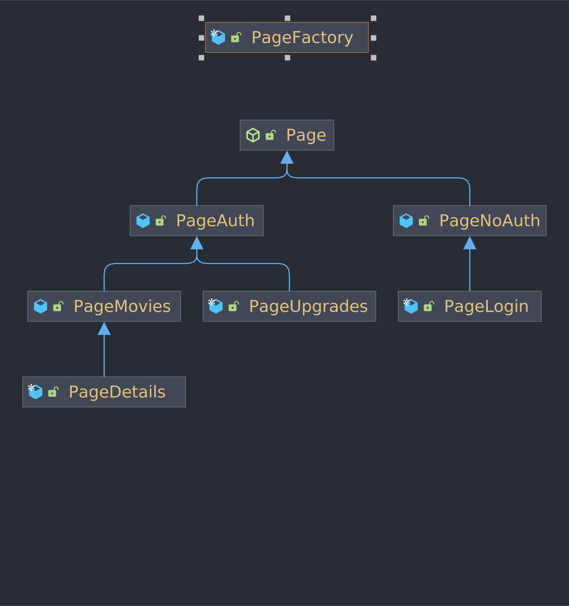
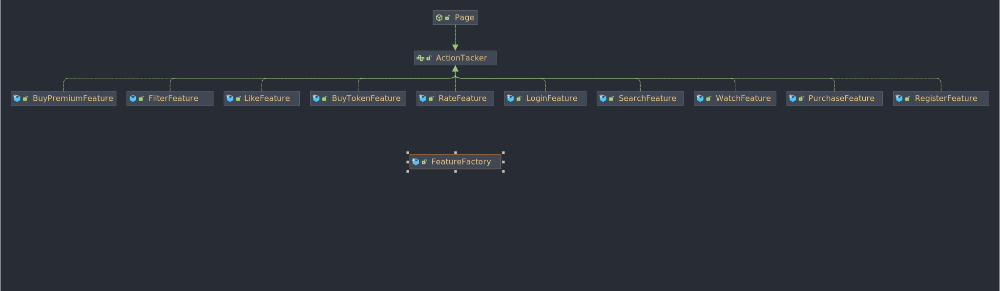

# streaming-service-backend
`Author : Corneliu Rotari` `Group : 323 CD`
___
1. [Description](#description)
2. [Project Structure](#project-structure)
3. [Implementation](#implementation)
   1. [Extension](#extension)
4. [Design Patterns](#design-patterns)
   1. [Singleton](#singleton)
   2. [Builder](#builder)
   3. [Factory](#factory)
   4. [Design Patterns that can be added](#design-patterns-that-can-be-added)

___
## Description
Simulates and backend for a streaming service application (ex. Netflix, Hulu, HBO, etc.).\
The API supports User Authentication, Movie Ratings, Filtering and Sorting, Page Specific Features.

___
## Project Structure
```
└── src
    ├── app
    │   ├── database
    │   ├── features
    │   │   ├── auth
    │   │   └── noauth
    │   └── pages
    │       ├── auth
    │       │   ├── movies
    │       │   │   └── details
    │       │   └── upgrade
    │       └── noauth
    │           ├── login
    │           └── regitser
    ├── components
    │   ├── filter
    │   ├── movie
    │   └── user
    │       └── accountType
    ├── io
    │   ├── input
    │   │   └── action
    │   └── output
    │       └── response
    └── utils
```
___
## Implementation
### App 
Throughout the implementation I opted for `HashedSet` to store the `Movies` and `User` to ensure single insertion.

There is [`Database.java`](./src/app/database/Database.java) that simulates the interaction with an External Database.

### Pages
Every Page has the allowed PagesTypes and FeaturesTypes to change/make in the constructor.



### Features
Every Feature implements ActionTacker to allow abstraction.



### I/O
Input and Output are managed using `Jackson Library` for `Json` Manipulation.

### Extension
Future plans for the API : 
1. Adding addition of Movies.
2. Adding UserTypes (ex. `"standard"`, `"premium"`, `...`).
3. More Features on each Page.
4. Multiple Filters.

___
## Design Patterns
### Singleton


`Motivation` : 

To centralise the information for the Application State.\
To extract the dependencies for Output form the Application class.

`Location` :
- [`Output.java`](./src/io/output/Output.java)
- [`App.java`](./src/app/App.java)

### Builder


`Motivation` :

To easily build a response from every place of the application.

`Location` :
- [`Response.java`](./src/io/output/response/Response.java)


### Factory 


`Motivation` :

To separate the building process for Pages And Features.

`Location` :
- [`PageFactory.java`](./src/app/pages/PageFactory.java)
- [`FeatureFactory.java`](./src/app/features/FeatureFactory.java)

### Command


`Motivation` :

To separate the Features from the pages that implement them.
To easily implement new features on extension.

`Location` :
- [`ActionTacker.java`](./src/app/features/ActionTacker.java) - Command Interface
- [`Page.java`](./src/app/pages/Page.java) - Invoker
- [`*Feature.java`](./src/app/features) - Receivers that implement the command
## Design Patterns that can be added
### Strategy


`Motivation` : To add new types of users or criteria to filter movies

`Location` :
- UserType :
    - StandardStrategy
    - PremiumStrategy
- FiltersStrategy :
    - SortStrategy
    - ContainsStrategy

### Facade 


`Motivation` : To encapsulate all the information for major Action

`Location` :
- Pages
- Features
___
