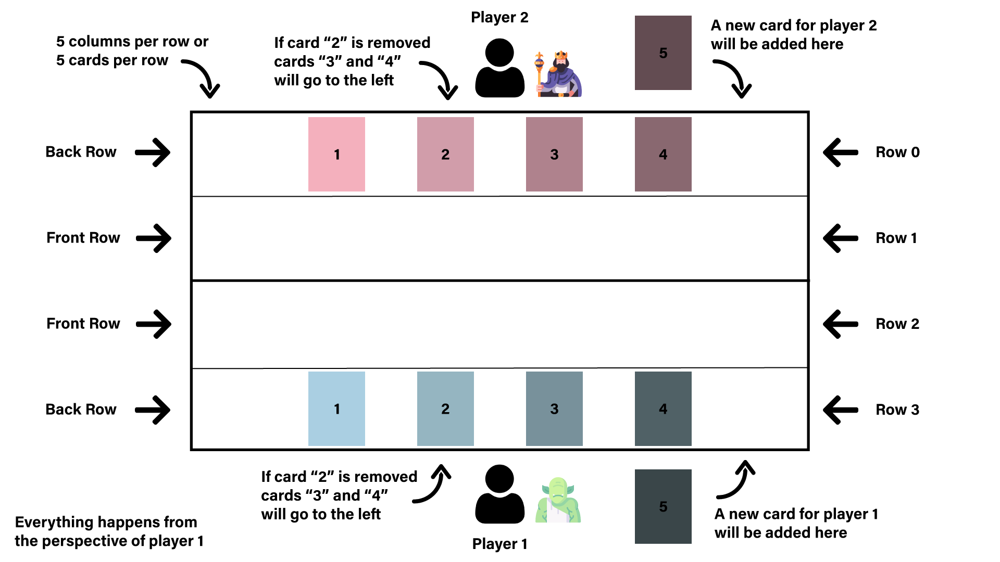
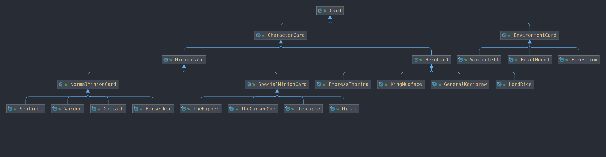
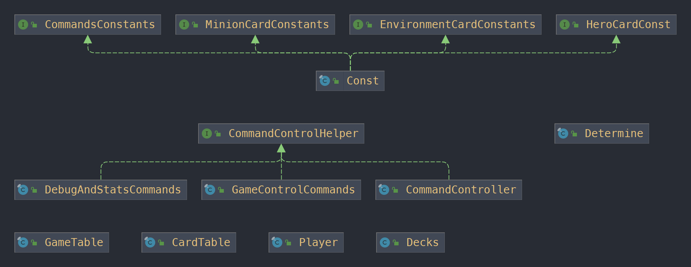

# **GwentStone**
```
Author : Rotari Corneliu
```

<div align="center"></div>

#### Assignment Link: [https://ocw.cs.pub.ro/courses/poo-ca-cd/teme/tema](https://ocw.cs.pub.ro/courses/poo-ca-cd/teme/tema)


## **Skel Structure**

* input/ - contains the tests in JSON format
* ref/ - contains all reference output for the tests in JSON format
* src/
  * checker/ - checker files
  * fileio/ - contains classes used to read data from the json files
  * main/
      * Main - the Main class runs the checker on your implementation. Add the entry point to your implementation in it. Run Main to test your implementation from the IDE or from command line.
      * Test - run the main method from Test class with the name of the input file from the command line and the result will be written
        to the out.txt file. Thus, you can compare this result with ref.

## **Description**
GwentStone is a card game that lets two players play a game of fantasy war, using different characters and abilities.
This game has the best attributes form two popular card games **Hearthston** and **Gwent**.



## **Implementation**

The hierarchy was divided in 3 main parts for easier access:
  1. Cards - contains all the cards used in the game
  2. Mechanics - contains all the logic to run the game
  3. Utils - contains a constants class and a decision maker class

## Cards
Cards are abilities that the player 
The idea behind this structure is that all the cards have a lot of common filed and methods. To reuses the constructor and to easily group them by categories, this hierarchy of cards was created.
- Environment cards have established abilities.
- Hero card is placed as the main character that the player must protect. When thw hero dies the game ends.
- Minions are worriers that sit on the Card Table and may attack, or in case of Special Minions may use their special ability.



## Mechanics and Utils 

The Game Table is a **Singleton** that coordinates the player's and the card table's actions by input. It decides when the turn ends and when the round ends. How much mana every player receives.
Important filed :    
- Card Table - (*composition*) takes care of what cards are place on the table and what happens when a card is destroyed.
- Players - two instances of Player class that contains the information about the playing players (his playing decks).   
   
Command Controller is a controller that decides where to send the specific command :  
- Debug and Statistics - outputs the information about the game, players, and card table situation.
- Game Controller - receives the command and takes action on the Game Table. 

Utils package :
- Const - stores the constants used in implementation.
- Determine - a decision maker, that determines what card to instantiate and other proprieties of Cards.




## Bonus information
To implement error handling in the commands' section is implemented using ``` throw Exepctions ``` and ```try {} catch() {}``` idea for a cleaner code.
For array there were used streams for an easier parse of array members for placing affects on specific card (ex: Hero cards special abilities).

## Feedback
It was a lot of fun to implement this game.
There were a lot o helpfull information on the forum.
A suggestion is to make some more tests that don't require the whole class hierarchy to exist until it can be tested.