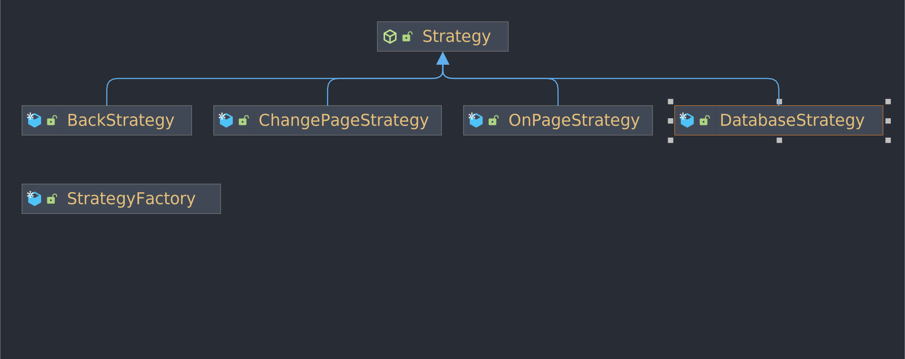

# streaming-service-backend
`Author : Corneliu Rotari` `Group : 323 CD`
___
1. [Description](#description)
2. [Project Structure](#project-structure)
3. [Implementation](#implementation)
   1. [App](#app)
   2. [Pages](#pages)
   3. [Features](#features)
   4. [I/O](#io)
4. [Design Patterns](#design-patterns)
   1. [Singleton](#singleton)
   2. [Builder](#builder)
   3. [Factory](#factory)
   4. [Command](#command)
   5. [Strategy](#strategy)
   6. [Observer](#observer)
5. [Feedback and extra](#feedback-and-extra)

___
## Description
Simulates and backend for a streaming service application (ex. Netflix, Hulu, HBO, etc.).\
The API supports User Authentication, Movie Ratings, Filtering and Sorting.\
Each Page has Specific Features implemented.

___
## Project Structure
```
└── src
    ├── app
    │   ├── database
    │   ├── features
    │   │   ├── auth
    │   │   └── noauth
    │   ├── history
    │   └── strategies
    │       └── strategy
    ├── checker
    ├── components
    │   ├── filter
    │   ├── genre
    │   ├── movie
    │   ├── notification
    │   ├── pages
    │   │   ├── auth
    │   │   │   ├── movies
    │   │   │   │   └── details
    │   │   │   └── upgrade
    │   │   └── noauth
    │   │       ├── login
    │   │       └── regitser
    │   └── user
    │       └── account
    ├── io
    │   ├── input
    │   │   └── request
    │   └── output
    │       └── response
    └── utils

```
___
## Implementation
### App 
Throughout the implementation I opted for `HashedSet` to store the `Movies` and `User` to ensure single insertion.

There is [`Database.java`](./src/app/database/Database.java) that simulates the interaction with an External Database.

[`History.java`](src/app/history/History.java) is a stack of all the visited pages by a logged-in user.
It's initialized with the home page inside

## Strategies

Every Strategy implements [`Strategy.java`](src/app/strategies/Strategy.java) interface and overrides the execute().



### Pages
Every Page has the allowed PagesTypes and FeaturesTypes to change/make in the constructor.


### Features
Every Feature implements ActionTacker to allow abstraction.


### I/O
[Input](src/io/input/Input.java) and 
[Output](src/io/output/Output.java) are managed using `Jackson Library` for `Json` Manipulation.


___
## Design Patterns
### Singleton


`Motivation` : 

To centralise the information for the Application State.\
To extract the dependencies for Output form the Application class.

`Location` :
- [`Output.java`](./src/io/output/Output.java)
- [`App.java`](./src/app/App.java)

### Builder


`Motivation` :

To easily build a response from every place of the application.

`Location` :
- [`Response.java`](./src/io/output/response/Response.java)


### Factory 


`Motivation` :

To separate the building process for Pages And Features.

`Location` :
- [`PageFactory.java`](./src/components/pages/PageFactory.java)
- [`FeatureFactory.java`](./src/app/features/FeatureFactory.java)
- [`StrategyFactory`](./src/app/strategies/StrategyFactory.java)

### Command


`Motivation` :

To separate the Features from the pages that implement them.
To easily implement new features on extension.

`Location` :
- [`ActionTacker.java`](./src/app/features/FeatureCommand.java) - Command Interface
- [`Page.java`](./src/components/pages/Page.java) - Invoker
- [`*Feature.java`](./src/app/features) - Receivers that implement the command
- 
### Strategy


`Motivation` : To encapsulate different types of action that are in the application.

`Location` :  
- [`BackStrategy.java`](src/app/strategies/strategy/BackStrategy.java)
- [`ChangePageStrategy.java`](src/app/strategies/strategy/ChangePageStrategy.java)
- [`DatabaseStrategy.java`](src/app/strategies/strategy/DatabaseStrategy.java)
- [`OnPageStrategy.java`](src/app/strategies/strategy/OnPageStrategy.java)

### Observer


`Motivation` : To easily notify the users about the addition or deletion of movies form the [Database](#App). 

`Location` :
- [`GenreManager.java`](src/components/genre/GenreManager.java) - the subscriber manager
- [`GenreSubscriber.java`](src/components/genre/GenreSubscriber.java) - subscriber


## Feedback and extra

### Extra
Streams are used for mapping and manipulation Collections.
Several classes extend a class (HashSet, LinkedList) for an easier encapsulation.

### Feedback 

It was a pleasure to work on this assignment.
It would be more helpfully if the tests were a little more packed with actions to simulate a better user experience.
___
